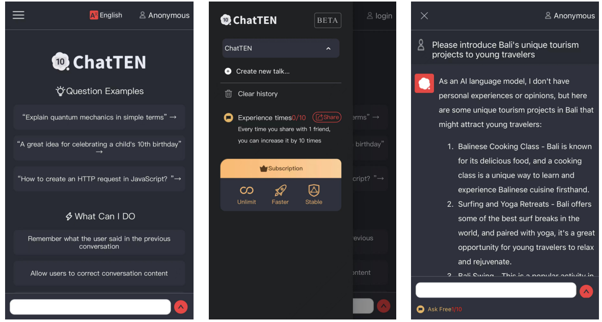

# 10. Examples of protocol-based products

The application development scenarios of the SAMA protocol include AI chat, private social networking, blogs, exchanges, self-media, design works, and more. ChatTEN is a distributed AI application developed based on the SAMA protocol. Users can access it out-of-the-box and have one-click conversations with AI such as ChatGPT while ensuring that their chat records with AI are not stolen, achieving secure internet access.\

## [AI chat application developed based on SAMA protocol.](https://pay.citypro-tech.com/)

<figure><figcaption></figcaption></figure>
