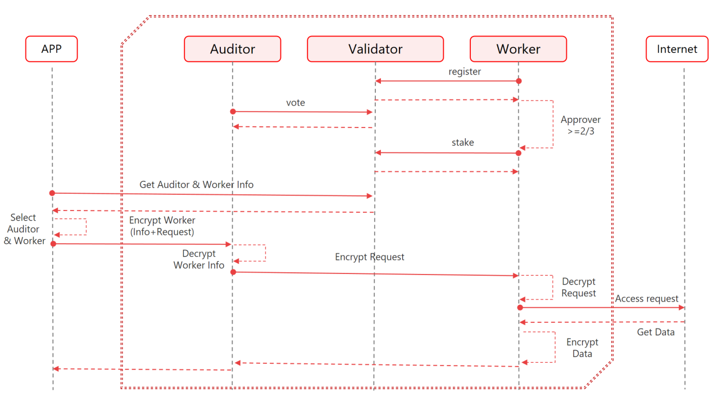

# 4.1. Encryption Process

<figure><figcaption></figcaption></figure>

\
The SAMA Privacy Protocol builds a distributed network into two logically independent sharded networks, the auditor network and the worker network. It is the encryption and decryption processes of the nodes in these two networks that guarantee the privacy of user data.

The following 10 steps show how audit nodes and worker nodes serve application users to access the Internet.\

**Step 1**  Audit nodes and worker nodes need to go through the registration and approval process to join the SAMA network, and the registration process is the same for audit nodes and worker nodes. The registration process for a node is as follows:

> * To be a candidate for worker and audit nodes, you must first join the avalanche subnet.
> * Each candidate node initiates a registration application to the avalanche chain.
> * After receiving the registration event, the working audit node user reviews the candidate node information of the working network and votes after reviewing the information of the working network's candidate node within the validity period of the event. If the number of votes supporting candidate node operations exceeds two-thirds of the number of user votes of the audit node, the selected worker network node is allowed to stake to become a formal working network node within the specified time to provide services to users.
> * Similarly, after receiving the registration event, the working audit node user reviews the candidate node information of the audit node network within the validity period of the event and votes. If the number of votes supporting candidate node operations exceeds two-thirds of the votes cast by candidate node users, the selected audit network node is allowed to pledge to become a formal audit network node to provide services to users within the specified time.\
>

**Step 2**    Users cannot see the audit node and worker node information, but can select the country, command line or network protocol through the APP.

**Step 3**   Users can view information such as the country where the server is located, and then select audit nodes and work nodes to serve them according to their preferences.

**Step 4**    The APP encrypts the work point information and user data selected by the user. First, the corresponding public key is selected and combined with the APP user's work private key to obtain the encrypted password through the ECDH algorithm. Then, the encryption is completed through the aes-128-cfb and chacha20-ietf-poly1305 algorithms

> * Worker node information encryption: The password is generated using the working public key of the selected audit node and the APP working private key, and encrypted by the chacha20-ietf-poly1305 algorithm.\
>
> * Data encryption: A password is generated using the working public key of the selected worker node and the APP working private key, and encrypted by the AES-128-CFB algorithm.

**Step 5**   After receiving the data pushed by the APP, the audit node decrypts the work node information through its own work private key and APP public key.

**Step 6**   The audit node will push the remaining encrypted data to the working node intact.

**Step 7**   The work node decrypts user encrypted data through its own work private key combined with the APP public key, and then accesses the internet.

**Step 8** After the internet returns data, the work node encrypts the returned data through the same encryption process and pushes it to the audit node.

**Step 9**   The audit node finds the corresponding APP link and pushes the data to the APP.

**Step 10**   After the APP is decrypted, it is sent to the user process to complete the entire access process.
