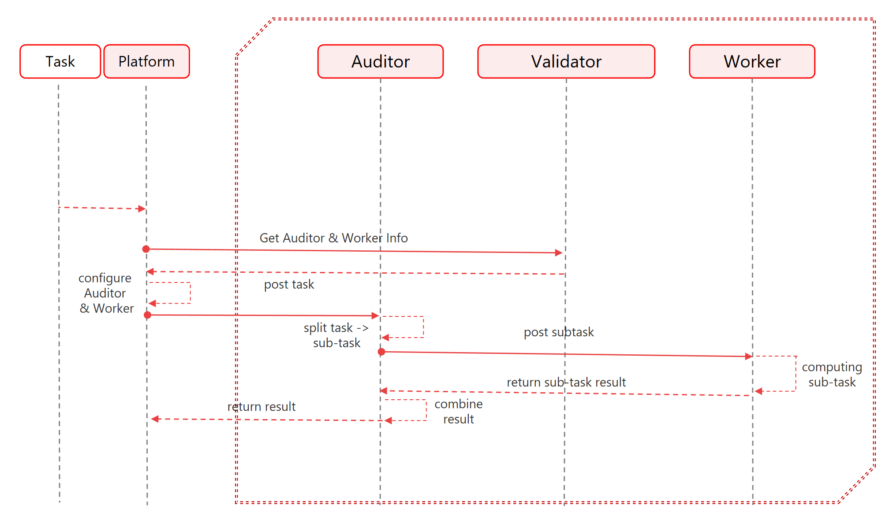

# 4.2. Calculation process

<figure><figcaption></figcaption></figure>

\
Platform SE middleware obtains all nodes of the distributed network through the SAMA chain, and the logically independent shard network on the workload network is the audit network and the working network. The audit network calculates the routing of computing subtasks to workers in the work network, and finally feeds back the sub-results to the auditors after the worker is completed, and then aggregates the results through middleware.

The following 6 steps demonstrate the entire budgeting process for auditing nodes and working nodes.

\
**Step 1**   Customers present computing algorithms and tasks to the middleware platform;

**Step 2**    The middleware platform evaluates the computational cost of the current algorithm;

**Setp 3**    After the customer locks in the fee, the task begins to be delivered to the auditor node;

**Step 4**    Auditors will split complex tasks into subtasks according to corresponding configurations;

**Step 5**   Sub-tasks will be dispatched to corresponding workers by the platform, and the workers are responsible for computing the results.

**Step 6**    After the workers compute the results, they return them to the auditor. The platform aggregates the results through the auditors to obtain the final computation result.

\
