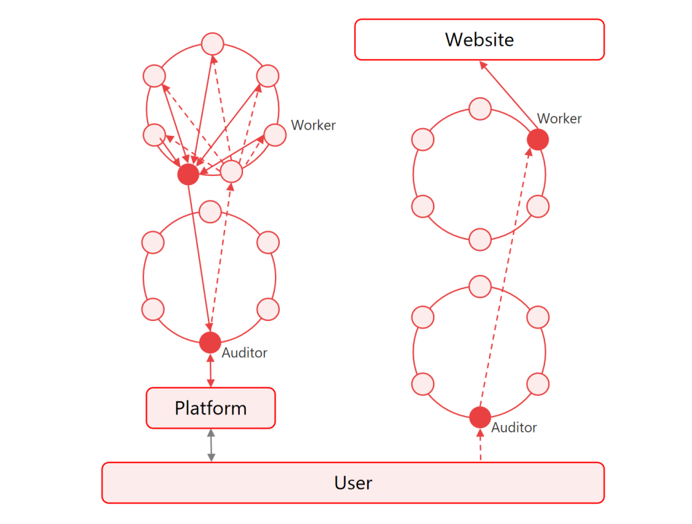

# 4.How SAMA networks work

<figure><figcaption></figcaption></figure>

The way users directly access the internet exposes their IP address and the content of their visits, leaving their privacy unprotected. Therefore, internet protocols that ensure user privacy have been developed and widely adopted.

SAMA protocol's network link data security and privacy protection technology principle is shown in the figure above. SAMA protocol uses a dual-ring distributed network to encrypt and isolate user data, fully protecting user data privacy and security.

In the proof-of-work network, audit nodes can see information such as the user's IP address, geography, and network behavior, but cannot view the specific content of the user's internet visits. When data is routed to work nodes, they can see the content the user is accessing but cannot see specific user information. This security isolation design protects user privacy and prevents data leakage and abuse. At the same time, this design enables SAMA protocol to easily handle high concurrency of these business data and solve the needs of large-scale user visits. Furthermore, it improves the network's scalability and reliability. Through this innovative network architecture and security isolation design, SAMA protocol provides users with a more secure, fast, and reliable internet browsing experience.

Customers deliver computing tasks through Platform SE middleware, where SE evaluates the computing algorithm and returns a budget quote after completing the evaluation. The customer then decides whether or not to dispatch the task for computation.

